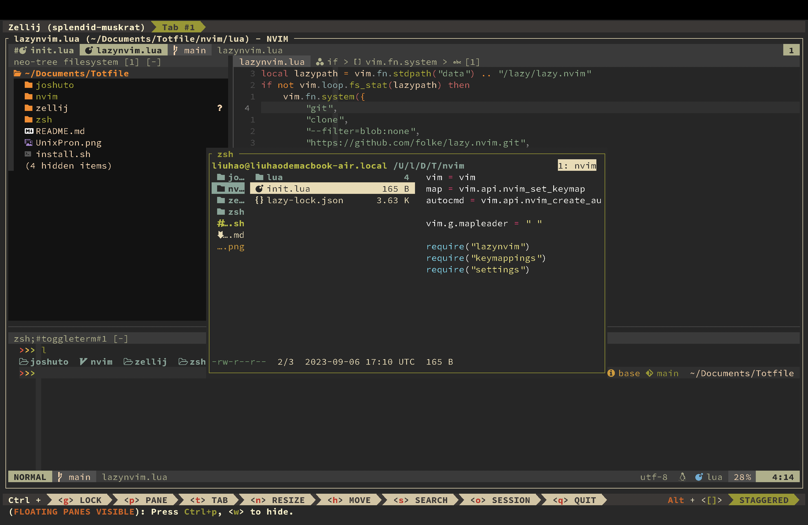

# Totfile

Totfile is my personal dotfile collection for terminal environments, crafted to enhance and personalize the command line experience.



## Installation

Clone this repository and execute the installation script to set up your environment:

```bash
git clone --recurse-submodules https://github.com/liiuhaao/Totfile.git
bash install.sh
```

## Key Components

- **[zsh](https://www.zsh.org):** Shell designed for interactive use.
- **[Neovim](https://github.com/neovim/neovim):** Advanced text editor.
- **[joshuto](https://github.com/kamiyaa/joshuto):** Terminal file manager.
- **[zellij](https://github.com/zellij-org/zellij):** Terminal multiplexer.
- **[lsd](https://github.com/Peltoche/lsd):** Modern, feature-rich alternative to 'ls'.


## Usage

For Neovim
```
:Lazy<CR>S
:Copilot auth
```
